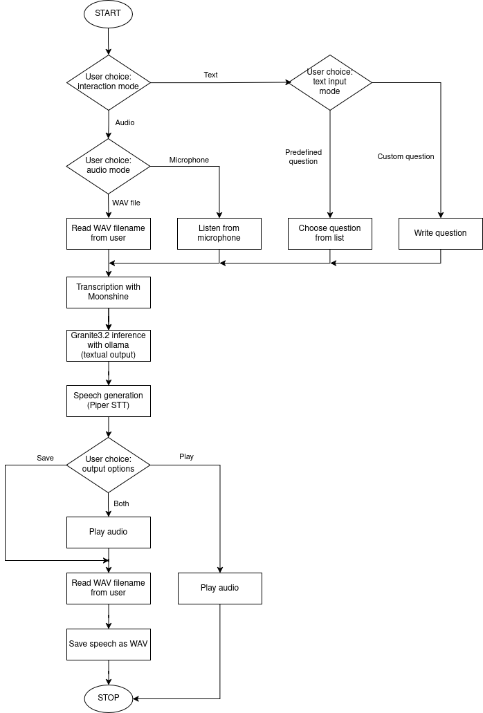

# Pipeline Project

This repository contains an interactive pipeline for voice transcription, local LLM interrogation, and output speech generation. Audio transcription is performed with [moonshine](https://github.com/usefulsensors/moonshine), LLM interrogation is performed with [ollama](https://github.com/ollama/ollama), speech synthesis is performed with [piper](https://github.com/rhasspy/piper). Here is a flowchart of the pipeline:


## Usage instructions

### 1. Install dependencies
To install this project you need `git`. On Debian-based distributions you can install it with:
```
sudo apt update
sudo apt install git
```

### 2. Clone the Repository
Clone the repository and navigate to its directory:
```
git clone git@github.com:CatoMaior/pipeline.git
cd pipeline
```

### 3. Run setup script
Run the setup script. It creates a virtual environment and installs the dependencies.
```
./setup.sh
```

### 4. Run the Pipeline
Activate the virtual environment:
```
source .venv/bin/activate
```
Start the main pipeline script:
```
python pipeline.py
```

You can customize the pipeline by modifying parameters in the `core/config.py` file. All parameters are thoroughly documented within the file.

## Performance Tests

The project includes a comprehensive performance testing framework to evaluate each pipeline component. After activating the virtual environment as in the section above, you can run it:
```
python performance_test.py [options]
```

### Command-line options:

- `--no-transcription`: Skip transcription performance tests
- `--no-synthesis`: Skip synthesis performance tests  
- `--no-llm`: Skip LLM inference performance tests
- `--save`: Save the performance test results to a file

For example, to test only the LLM component:
```
python performance_test.py --no-transcription --no-synthesis
```

The results are logged to the console and saved in the `performance_logs` directory in a directory with the hostname of the machine running the tests, with a symlink called `latest` pointing to the most recent results.

Synthesis tests are performed on selected texts that generate around 20 seconds of speech. Transcription tests are performed on audio files about 20 second long. LLM tests use prompts designed to elicit brief responses, optimizing test efficiency by reducing inference time.